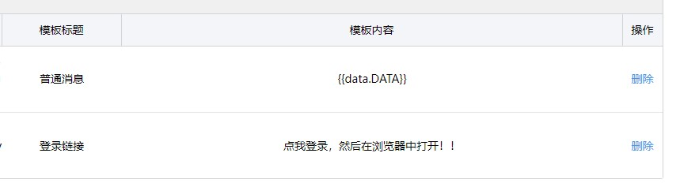

## 推送配置<!-- {docsify-ignore} -->

*一共有以下五种推送方式*
+ 微信公众号测试号推送
+ 网页推送
+ telegram推送
+ 微信pushPlus推送
+ 钉钉推送

> 其中pushPlus和钉钉推送相互冲突，因为两种推送模式都只能单方面配合定时运行功能使用，只能接收消息，不能发送消息；

> 在公众号测试号和tg推送以及定时三种只要配置了任意一种，程序将自动卡住等待用户指令。

> 若您想打开程序就运行，请关闭这三项配置；当前程序默认开启cron定时,所以新版若不想程序一直等待则关闭cron即可。

> 微信公众号和网页需要公网ip,若没有建议更换其他推送方式，或者自行配置内网穿透，tg推送需要配置代理或者自己反代tg的api，钉钉和pushPlus仅支持单向推送，一般配合定时使用

### 定时配置

定时任务和一下所有推送均可配合一起使用，cron的语法遵循linux标准cron语法，详情可百度自行查询

因为一些不知名的bug,观看视频时可能卡住不加分，所以建议一天运行三次左右定时，同时多次定时之间间隔不要太短

为防止定时任务每天在同一时间触发，可以配置**cron_random_wait**,等待随机时间再运行任务

除此之外，还支持以下语法
+ @yearly：也可以写作@annually，表示每年第一天的 0 点。等价于0 0 1 1 *；
+ @monthly：表示每月第一天的 0 点。等价于0 0 1 * *；
+ @weekly：表示每周第一天的 0 点，注意第一天为周日，即周六结束，周日开始的那个 0 点。等价于0 0 * * 0；
+ @daily：也可以写作@midnight，表示每天 0 点。等价于0 0 * * *；
+ @hourly：表示每小时的开始。等价于0 * * * *。
+ @every duration: duration为任意时间端，例如 1h,1s,1s，1h30m2s，代表间隔时间段就指向一次

### 微信公众号推送
配置config.yml的如下部分
```yaml
# 微信公众号测试号配置
wechat:
  # 是否启用
  enable: false
  # 开发者平台设置的token
  token: ""
  # 开发者平台的secret
  secret: ""
  # 开发者平台的appId
  app_id: ""
  # 发送登录消息需要使用的消息模板
  # 模板标题，随意  模板内容：  点我登录，然后在浏览器中打开！！
  login_temp_id: ""
  # 发送普通消息需要使用的消息模板
  # 模板标题：随意 模板内容： {{data.DATA}}
  normal_temp_id: ""
  # xxqg会每隔两小时左右检查所有用户的ck有效性，若开启该选项，会在检查失败时推送提醒消息
  push_login_warn: false
  # 微信管理员的openid,可点击关于按钮获得，配置后请重启程序
  super_open_id: ""
```

+ 前往微信[公众号开发者平台](http://mp.weixin.qq.com/debug/cgi-bin/sandbox?t=sandbox/login)，手机微信扫码登录
+ 配置url为**http://ip:port/wx**,ip为你运行机器的公网ip,若使用docker运行，端口则为宿主机中映射出来的端口，ip和端口的配置和web使用同一个配置
+ 设置token,需和配置项中一样
+ 分别添加登录模板消息和普通模板消息，添加要求:



+ 在配置文件中配置所有内容，启动程序
+ 运行程序后，在浏览器中访问配置的url,页面会返回``No Signature!``,然后提交配置，若成功则关注公众号尝试运行
+ docker运行方式参考[linux运行](./linux/index.md)
+ 配置成功后可点击关于按钮获取open_id，然后填写到配置项的super_open_id中，然后重启容器生效


### web推送
> 适用于部署在服务器上或者家里有公网IP的设备上

配置config.yml的如下部分
```yaml
web:
  # 启用web
  enable: true
  # 监听的ip,若只需要本机访问则设置为127.0.0.1，监听本机所有ip为0.0.0.0
  host: 0.0.0.0
  # 监听的端口号 0-65535可选
  port: 8081
  # web端登录管理员的账号
  account：admin
  # web端登录管理员的密码
  password: admin
  # web端登录普通用户的账号密码，支持多个用户,普通用户只能看到自己的信息
  common_user:
    # 代表账号为user,密码为123的普通用户，可添加多个，继续在下面写就好了
    user: 123
    
    # user1: 123
    # user2: 123
  
```

+ 开启后通过浏览器访问 *http://ip:port*或者*http://ip:port/new*即可打开网址 ,若为docker运行，则ip为宿主机公网ip,端口为docker映射到宿主机的端口
+ 若无法访问，首先检查程序运行日志，查看有无报错，其次查看docker的运行情况，端口是否映射正常，然后可以通过curl命令检测在宿主机中能否访问，然后检查防火墙之类的
+ 若点击登录之后出现一个小框然后无反应，则说明账户密码错误，请重新配置程序账户密码并重启程序

> 登录的账号密码是在配置文件中配置，不是学习强国的登录账号，管理员登录支持删除用户，同时能看到所有人的用户信息，普通用户就是```common_user```下面配置的用户，支持多个用户，键是账号，值是密码

### 钉钉推送
配置config.yml的如下部分,具体使用教程详情参考[钉钉](https://developers.dingtalk.com/document/robots/custom-robot-access?spm=ding_open_doc.document.0.0.7f875e5903iVpC#topic-2026027)
```yaml
ding:
    enable: true
    access_token: ""
    secret: ""
```
+ 在电脑端钉钉中创建群聊，在聊天设置中选择只能群助手，选择添加机器人，机器人类别选择webhook自定义机器人
+ 机器人名字任意，机器人安全设置勾选加签，复制加签的密钥，作为secret配置项填入配置文件中
+ 勾选协议，确认添加，会出现一个webhook地址，形如这样：```https://oapi.dingtalk.com/robot/send?access_token=aaabbbbcccc```
+ 将上述地址中的后半段，就是access_token=之后的内容作为access_token配置项填入配置文件中，例如上述网址，则填入aaabbbccc到access_token中
+ 设置定时cron,启动程序，程序会在定时时间运行脚本

### pushplus推送
配置config.yml的如下部分，具体使用教程参考[pushplus](https://www.pushplus.plus/)
```yaml
  push_plus:
    enable: true
    token: ""
```
### telegram推送 
## Telegram Bot
配置 config.yml的如下部分
```yaml
tg:
  enable: false
  chat_id: 0
  token: ""
  # telegram的代理，不配置默认走系统代理
  proxy: ""
  # 自定义tg的api,可通过cloudflare搭建，需自备域名
  custom_api: "https://api.telegram.org"
  # 白名单id,包括群id或者用户id,若为空，则允许所有群所有用户使用，若仅用于单人，直接配置上面的chat_id就可以
  white_list:
    - 123
```

### 配置

1. 在 Tg 中搜索[`@BotFather`](https://t.me/BotFather) ，发送指令`/newbot`创建一个 bot
2. 获取你创建好的 API Token 格式为`123456789:AAaaaa-Uuuuuuuuuuu` ,要完整复制**全部内容**
3. 在 Tg 中搜索[`@userinfobot`](https://t.me/userinfobot) ，点击`START`，它就会给你发送你的信息，记住 Id 即可，是一串数字。
4. 跟你创建的 bot 会话，点击`START`，或者发送`/start`
5. 将第 2 步获取的 token 放在`tokenn`中，第 3 步获取的 Id 放到`chat_id`中，`enable`设置为 true。
6. 因为众所周知的原因，telegram推送需要进行配置代理，例如clash的代理配置为```http://127.0.0.1:7890```即可，若通过cf反代的api,,则填写到**custom_api**配置项
7. 若不配置代理的情况下会默认走系统代理，white_list建议填写自己的chat_id,为可以使用机器人的白名单，若需要在群组中使用，请相应进行配置

增加 telegram bot 指令支持

`/login` 添加一个用户

`/get_users` 获取所有cookie有效的用户

`/study 张三` 指定账号学习,若只存在一个用户则自动选择学习

`/get_scores` 获取账户积分

`/quit` 退出正在学习的实例，当长时间无响应时建议退出并查看日志然后提交issue

`/study_all` 按顺序对cookie有效的所有用户进行学习


### QQ推送配置

qq推送配置支持双向交互，不过需要对接go-cqhttp框架
配置：
```yaml
qq:
  # 是否启用qq推送
  enable: true
  # gocq端监听的地址，默认是5700端口，ip根据自己的网络环境调整
  post_addr: "http://127.0.0.1:5700"
  # 管理员qq号
  super_user: 123
  # gocq端配置的access_token
  access_token: 123
  # 白名单消息
  white_list:
    - 123
```

gocq端配置
```yaml
servers:
  # HTTP 通信设置
  - http:
      # 是否关闭正向HTTP服务器
      disabled: false
      # 服务端监听地址
      host: 127.0.0.1
      # 服务端监听端口
      port: 5700
      # 反向HTTP超时时间, 单位秒
      # 最小值为5，小于5将会忽略本项设置
      timeout: 5
      middlewares:
        <<: *default # 引用默认中间件
      # 反向HTTP POST地址列表
      post:
        -
          url: 'http://127.0.0.1:8085/qq' # 此处配置为study_xxqg的网页地址加上/qq
          secret: ''          # 密钥

```

更多细节请查看go-cqhttp文档
qq命令请输入```.help```查看

### PushDeer推送配置

pishDeer也仅支持单向推送

配置：
```yaml
push_deer:
  enable: true
  api: "https://api2.pushdeer.com"
  token: ""
```

自行注册pushDeer后获取token,配置token到配置文件即可，api默认为官方api,若为自建，则配置对应接口即可